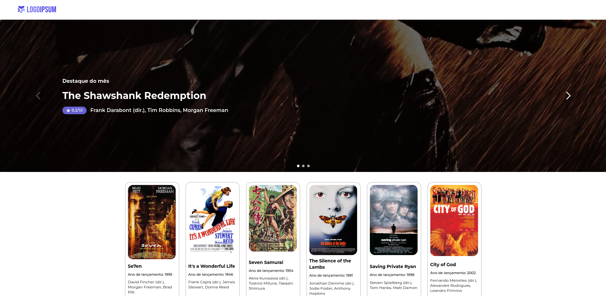
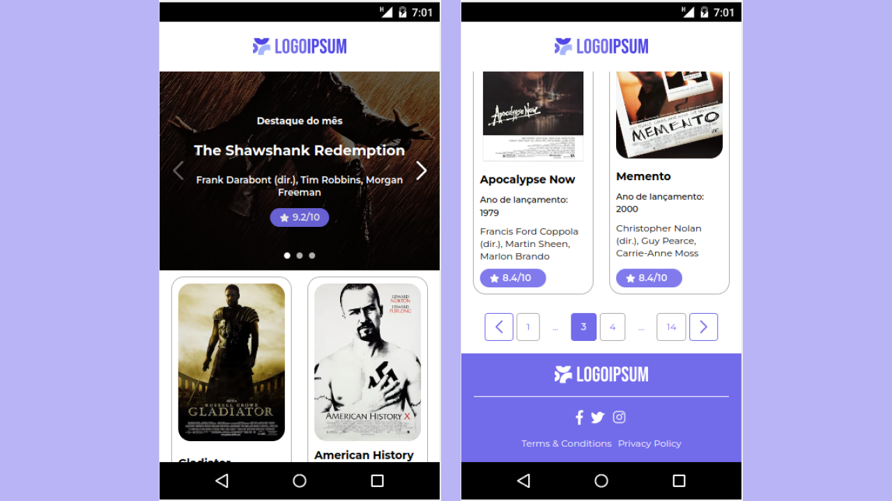

<h1 align="center">
    
    <br>
</h1>
<h4 align="center">
  Bem-vindo(a) ao repositório da aplicação Primer Movie
</h4>

## 📋 Objetivo
Objetivo da aplicação é replicar um design de uma locadora de filmes pré-definido no Figma.


---
## 🚀 Tecnologias Utilizadas

- NextJS
- SwiperJS
- TypeScript
- TailwindCSS
- Axios
- Phosphor-react
- ESLint
- Prettier


---

---
## 👁Deploy da aplicação

**link:** https://primer-movies.vercel.app/movies/1


---
## 🛠️ Como instalar

**#Clonar este repositório**

```
git clone https://github.com/edersonlucas/primer-movies
```

**#Entre na pasta do projeto**

```
cd primer-movies
```

**#Renomeie o arquivo ".env-example" que está na pasta raiz do projeto para ".env"**

⚠️ **Atenção**: Você precisa ter o Node.js LTS v16 (ou qualquer versão superior)

**#Instalando as dependencias**

```
npm install
```
**#Rodando o aplicação**

```
npm run dev
```

**#Acesse a aplicação no seguinte endereço**

```
http://localhost:3000/movies/1
```

---

#### [🚨](https://emojiterra.com/pt/luz-giratoria/) Em caso de dúvida, entre em contato.

[Email](edersonlucas@outlook.com.br)

[Linkedin](https://www.linkedin.com/in/edersonlucas/)

---

Desenvolvido por: [Ederson Lucas](https://www.linkedin.com/in/edersonlucas/)